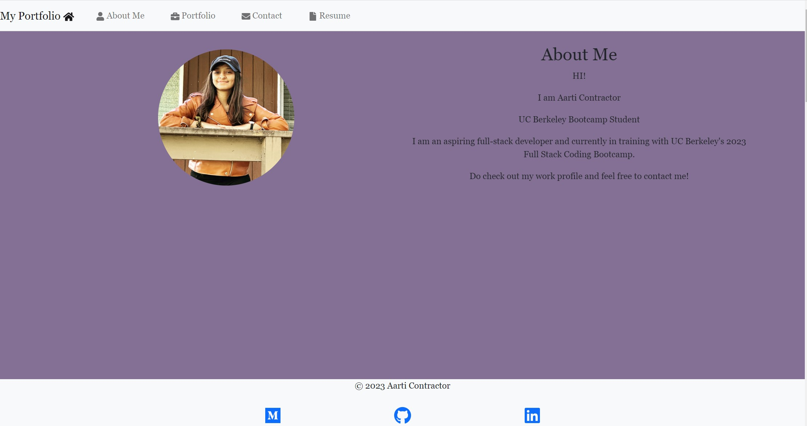

# My Portfolio

## Technology Used 

| Technology Used         | Resource URL           | 
| ------------- |:-------------:|    
| Git | [https://git-scm.com/](https://git-scm.com/)     |  
| JavaScript | [https://developer.mozilla.org/en-US/docs/Web/JavaScript](https://developer.mozilla.org/en-US/docs/Web/JavaScript) |  
| NodeJs | [https://nodejs.org/en](https://nodejs.org/en) |
| ExpressJS | [https://www.npmjs.com/package/express](https://www.npmjs.com/package/express) |
|  React | [https://react.dev/](https://react.dev/) |
|  Bootstrap | [https://getbootstrap.com/](https://getbootstrap.com/) |

 
 

## Table of Contents
- [Technologies](#technologies)
- [Description](#description)
- [Features](#features)
- [Installation](#installation)
- [Application Highlights](#application-highlights)
- [Credits](#credits)
 
 

## Description 

[Visit the Deployed Site](https://aarticontractor.github.io/aarti_react_folio/)

Welcome to my portfolio! This portfolio project was built using React, a popular JavaScript library for building user interfaces. It serves as a central hub to present my work samples, skills, and experience to potential employers or clients. The portfolio follows a single-page application structure, with a header, navigation, content sections, and a footer.

 
 

## Installation
To run the portfolio locally on your machine, follow these steps:
1. Clone this repository to your local machine using the command: `git clone https://github.com/aarticontractor/aarti_react_folio`
2. Navigate to the project directory: `cd aarti_react_folio`
3. Install the required dependencies by running the command: `npm install`
 
Once you have installed the dependencies, you can start the portfolio by running the command: `npm start`. This will launch the portfolio in your default browser, allowing you to navigate through the different sections and view my work samples. Feel free to explore, interact with the contact form, and download my resume.

## Application Highlights:
When I load my portfolio, my name, a recent photo, and links to sections about me, my work, and my contact details are presented:

 
 
 
When I click on the project link, the application's image is larger in size than the other showing a hover effect:

 
 
 

## Features
- **Header:** The portfolio includes a persistent header that appears on all pages, providing consistent branding and navigation links.
- **Navigation:** The header contains a navigation component that allows users to easily switch between different sections of the portfolio, including About Me, Portfolio, Contact, and Resume.
- **Content Sections:** Each section of the portfolio provides specific information and functionality:
  - **About Me:** Presents a brief introduction, including a recent photo or avatar and a short bio about me.
  - **Portfolio:** Showcases titled images of six of my applications, along with links to both the deployed applications and their corresponding GitHub repositories.
  - **Contact:** Includes a contact form with fields for name, email address, and message, allowing visitors to get in touch with me.
  - **Resume:** Provides a link to download my resume and lists my proficiencies, highlighting the technologies and skills I have expertise in.
- **Footer:** The portfolio includes a footer section that appears on all pages, containing text or icon links to my GitHub and LinkedIn profiles, as well as my profile on a third platform such as Medium.

 ## Credits

- https://developer.mozilla.org/en-US/docs/Web/JavaScript
- https://cloudconvert.com/webm-to-gif
- https://nodejs.org/en
- https://www.npmjs.com/package/express
- https://react.dev/
- https://getbootstrap.com/

## Author Info

### Aarti Contractor

- Portfolio: https://aarticontractor.github.io/aarticontractor_portfolio/
- Linkedin: https://www.linkedin.com/in/aarti-contractor/
- Github: https://github.com/aarticontractor

 

© 2023 edX Boot Camps LLC. Confidential and Proprietary. All Rights Reserved.
